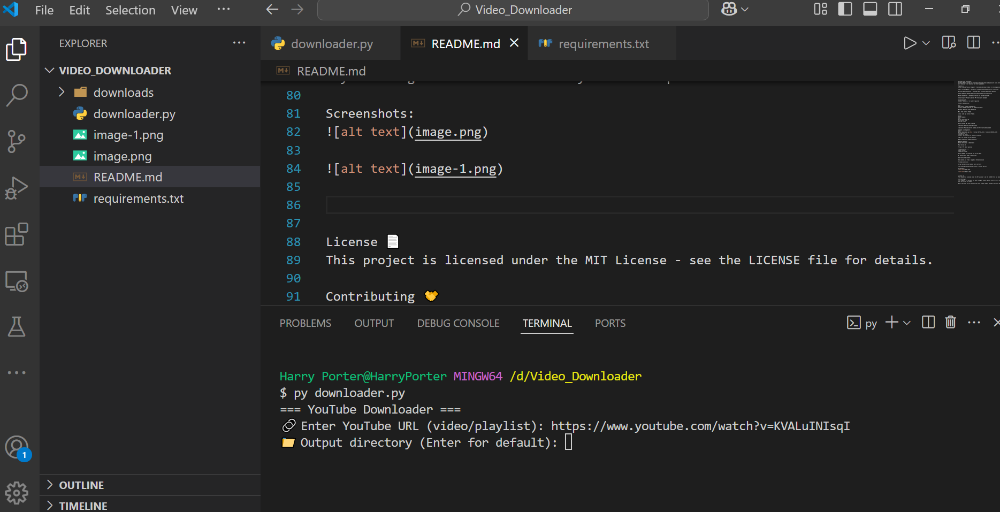

YouTube Video Downloader 🎬
A robust Python script for downloading YouTube videos and playlists using yt-dlp with enhanced error handling and file management.

Features ✨
Single Video & Playlist Support - Download individual videos or entire playlists

Smart File Management - Automatic filename cleaning and conflict resolution

Multiple Quality Options - Downloads best available quality by default

Cookie Support - Handle age-restricted content with cookies.txt

Resume Capability - Automatic retries for failed downloads

Clean Output - Properly merged MP4 files with metadata

Installation ⚙️
Install Python (3.7 or higher required)

Install dependencies:

bash
pip install yt-dlp ffmpeg-python
Install FFmpeg (required for merging streams):

Windows: Download from FFmpeg.org

Mac: brew install ffmpeg

Linux: sudo apt install ffmpeg

Usage 🚀
Basic Command:
bash
python downloader.py
Interactive Mode:
Run the script

Enter YouTube URL when prompted

(Optional) Specify output directory

(Optional) Provide path to cookies.txt for restricted content

Command Line Arguments:
bash
python downloader.py [URL] [--output OUTPUT_DIR] [--cookies COOKIES_FILE]
Configuration ⚙️
cookies.txt Setup:
Install "Get cookies.txt" browser extension

Log in to YouTube in your browser

Export cookies to cookies.txt file

Default Settings:
Output directory: ./downloads/

Max retries: 3

Format: MP4 (best quality)

Troubleshooting 🛠️
Common Issues:
FFmpeg not found:

Ensure FFmpeg is installed and in your PATH

Or specify full path in the script

Age-restricted content:

Use cookies.txt from a logged-in YouTube session

Filename conflicts:

Script automatically handles most conflicts

Try cleaning the download directory if issues persist

Screenshots:

License 📄
This project is licensed under the MIT License - see the LICENSE file for details.

Contributing 🤝
Pull requests are welcome! For major changes, please open an issue first to discuss what you'd like to change.

Note: This tool is for personal use only. Please respect YouTube's Terms of Service.